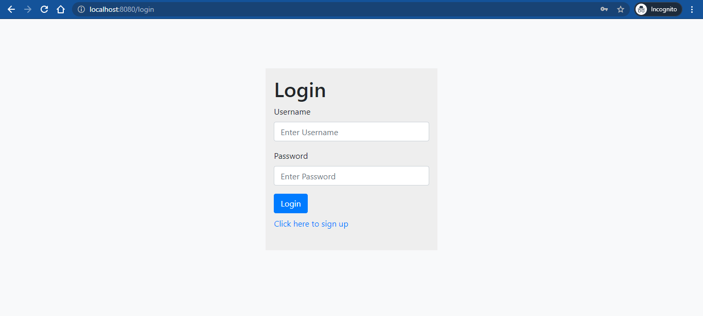
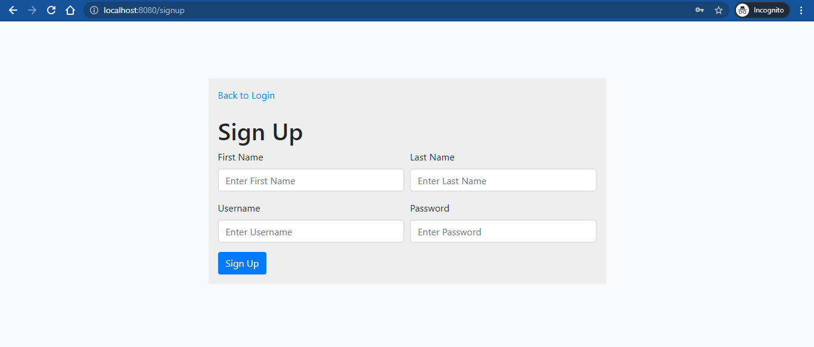
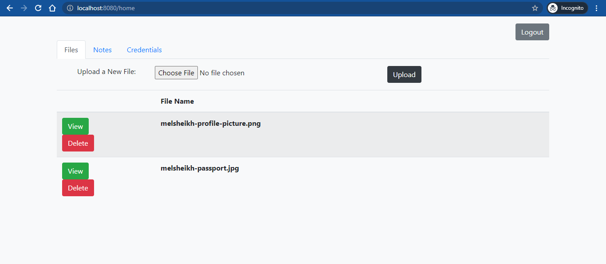
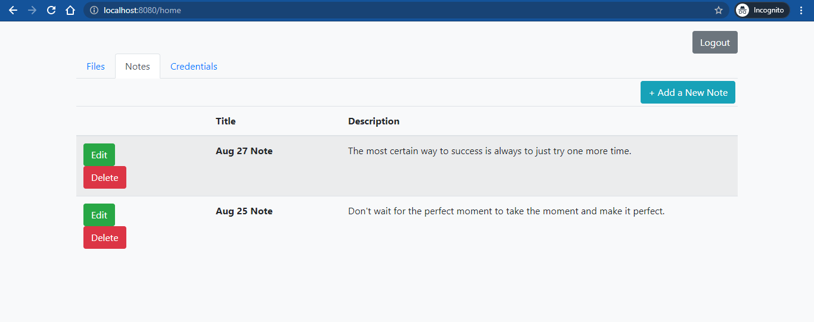
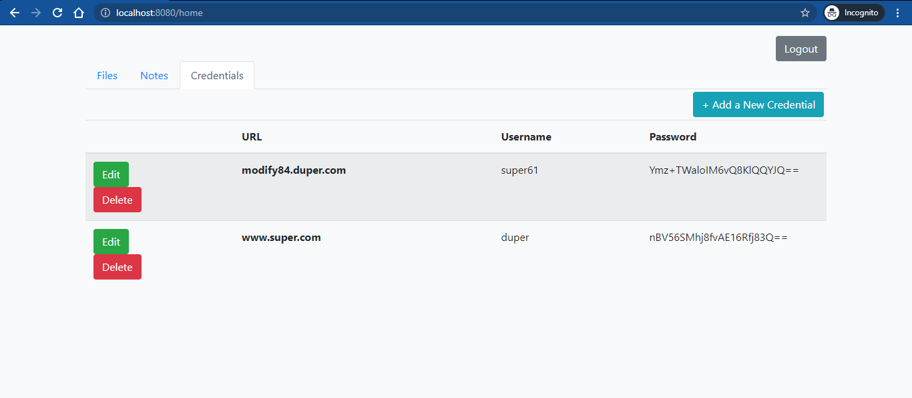

# Super*Duper*Drive Cloud Storage
You have been hired by Super*Duper*Drive, which is a brand new company aiming to make a dent in the Cloud Storage market and is already facing stiff competition from rivals like Google Drive and Dropbox. That hasn't dampened their spirits at all, however. They want to include personal information management features in their application to differentiate them from the competition, and the minimum viable product includes three user-facing features:

1. **Simple File Storage:** Upload/download/remove files
2. **Note Management:** Add/update/remove text notes
3. **Password Management:** Save, edit, and delete website credentials.  

Super*Duper*Drive wants you to focus on building the web application with the skills you acquired in this course. That means you are responsible for developing the server, website, and tests, but other tasks like deployment belong to other teams at the company. 

## Implementations

1. The back-end with Spring Boot
2. The front-end with Thymeleaf
3. Application tests with Selenium

### The Back-End

1. Managing user access with Spring Security
2. Handling front-end calls with controllers
3. Making calls to the database with MyBatis mappers

### The Front-End

1. Login page
    - Can be accessed by everyone to log in with existing user

2. Sign Up page
    - Can be accessed by everyone to sign up a new user
    - Protected passwords using [Salted Secure Hash Algorithm](https://doubleoctopus.com/security-wiki/encryption-and-cryptography/salted-secure-hash-algorithm/#:~:text=Salted%20secured%20hash%20algorithm%20helps,attacks%20by%20introducing%20additional%20randomness.&text=The%20salt%20and%20the%20password,the%20salt%20in%20a%20database.)

3. Home page
The home page is the center of the application and hosts the three required pieces of functionality. The template presents them as three tabs that can be clicked through by the user:

 i. Files
  - List previously-uploaded files.
  - View/download or delete previously-uploaded files.
  

 ii. Notes
  - List, Edit or Delete previously-created notes
  - Create new notes

 iii. Credentials
 - Store credentials for specific websites
 - List, Edit or Delete previously-created credentials
 - Protected passwords using [AES](https://en.wikipedia.org/wiki/Advanced_Encryption_Standard)
 - Ability to view single credential with unencrypted password

### Testing
Implemented Selenium tests to verify user-facing functionality and for feature-complete proof.

1. Tests for user signup, login, and unauthorized access restrictions.
2. Tests for note creation, viewing, editing, and deletion.
3. Tests for credential creation, viewing, editing, and deletion.
